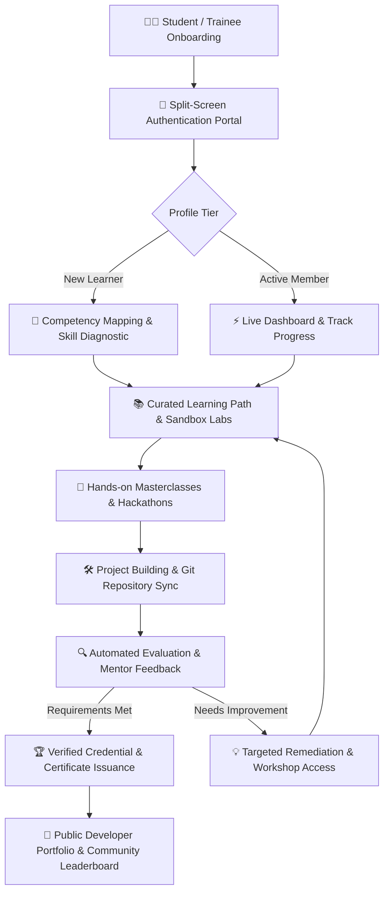

# 

<div align="center">

# SARTHI (सारथी)
### AI-Enabled Student Developer, Skill Enablement & Technical Career Navigator Platform

*Empowering the next generation of engineers with structured learning pathways, hands-on masterclasses, and real-world project portfolios.*

[](https://vitejs.dev/)
[](https://developer.mozilla.org/)
[](https://developer.mozilla.org/)
[]()
[]()
[](https://github.com/mohitraj8503/SARTHI/pulls)

**SARTHI** is an end-to-end student learning ecosystem, hackathon portal, and developer community platform. Built to bridge the critical gap between academic curriculum and high-impact industry engineering standards, it delivers structured technical roadmaps, live event registration, mentorship tracking, and split-screen role authentication.

[What is SARTHI?](#-what-is-sarthi-in-one-line) • [The Real Problem](#-why-does-this-exist-the-real-problem) • [Platform Flowchart](#-platform-architecture--learning-flowchart) • [How It Works](#-how-it-works-in-3-core-pillars) • [Feature Matrix](#-platform-modules--feature-matrix) • [Tech Stack](#%EF%B8%8F-tech-stack--engineering-pipeline) • [Quick Start](#%EF%B8%8F-getting-started-running-it-yourself) • [Roadmap](#-%EF%B8%8F-roadmap--future-milestones)

---

</div>

## 💡 What is SARTHI, in one line?

> **SARTHI is your technical co-pilot and navigator — transforming student developers into industry-ready engineers through curated technical roadmaps, hands-on bootcamps, and verified project portfolios.**

From freshman-year fundamentals to advanced cloud architectures, artificial intelligence, and open-source contributions, **SARTHI** guides every step of a student's technical career trajectory.

---

## 🎯 Why does this exist? (The Real Problem)

Engineering students across universities face critical systemic hurdles:

1. **Theoretical vs Practical Disconnect**: College curricula often focus heavily on rote theory, leaving students without practical experience in version control, CI/CD, and scalable web architectures.
2. **Information Overload Without Direction**: Thousands of scattered YouTube tutorials and documentation sites create "tutorial hell" without structured competency evaluation.
3. **Fragmented Event & Workshop Management**: Technical clubs and communities juggle fragmented forms, manual spreadsheets, and unverified participation certificates.
4. **Lack of Peer Collaboration & Mentorship**: Isolated learning without senior mentors or collaborative hackathons limits real-world team building.

**SARTHI solves this at the root**: *A single, centralized, blazing-fast platform providing guided paths, live workshops, verified credentials, and an active developer community.*

---

## 🧠 Platform Architecture & Learning Flowchart

SARTHI connects learners, trainers, and club administrators into a cohesive lifecycle:



---

## 🔍 How It Works (In 3 Core Pillars)

### 📌 Pillar 1 — Guided Learning & Competency Mapping
Learners access structured paths spanning Software Development, Cloud (Azure/AWS), Open-Source (Git/GitHub), and AI/ML. Each track contains milestone-driven modules with verifiable checkpoints and practical code repositories.

### 📌 Pillar 2 — High-Impact Events & Masterclass Engine
Integrated event hubs with real-time countdowns, interactive agendas, speaker profiles, and live workshop portals. Students can enroll with a single click, track daily attendance, and submit assignments seamlessly.

### 📌 Pillar 3 — Split-Screen Auth & Community Portals
Dedicated, aesthetically crafted authentication portals for students, faculty mentors, and event organizers with responsive split-screen layouts, instant form validation, and role-based navigation guards.

---

## 🛡️ Platform Modules & Feature Matrix

| Module | Route / File | Core Capabilities & Features |
| :--- | :--- | :--- |
| **Landing Hero** | `index.html` / `home.html` | High-impact visual branding, dynamic 3D cylinder animations, real-time stats, and quick CTA actions. |
| **Learning Catalog** | `courses/` | Structured competency tracks, prerequisites, syllabus timelines, and project deliverables. |
| **Event Portal** | `events.html` | Upcoming hackathons, multi-day masterclasses, live attendance verification, and past event archives. |
| **Authentication** | `login.html` & `signup.html` | Modern split-screen layout with visual branding panel, client validation, and credential security. |
| **About & Mission** | `about.html` | Vision statement, community timeline, university affiliation, and student leadership showcase. |
| **Membership** | `membership.html` | Tiered member perks, workshop benefits, resource access, and certification criteria. |
| **Community Hub** | `team/` & `contact.html` | Faculty advisory board, student leads, direct contact forms, and social media integration. |
| **Blog & Changelog** | `blog/` | Technical tutorials, release notes, student spotlights, and open-source updates. |

---

## 🎨 Design System & Visual Architecture

SARTHI combines modern dark-mode aesthetic with the vibrant Indian tricolor identity:

```text
                                  SARTHI UI SYSTEM
                                         │
                 ┌───────────────────────┴───────────────────────┐
                 ▼                                               ▼
     [Tricolor Brand Identity]                       [Dark Glassmorphism]
     • Deep Saffron  (#F97316)                       • Slate Dark Base (#0A0A12)
     • Pure White    (#FFFFFF)                       • Frosted Blur Glass (24px)
     • India Green   (#22C55E)                       • Multi-Layer Depth Shadows
```

- **Typography**: Precision geometric sans-serif headings with balanced text wrapping (`text-wrap: balance`).
- **Touch Responsiveness**: Minimum 44×44px touch targets across all mobile buttons, carousels, and forms.
- **Performance**: Zero bulky CSS framework overhead; sub-millisecond paint times.

---

## 🛠️ Tech Stack & Engineering Pipeline

- **Markup & Styling**: Semantic HTML5, Modular CSS3, CSS Grid & Flexbox, Custom Glassmorphism Filters
- **Scripting & Interactivity**: Modern JavaScript (ES6+), Touch Swipe Gesture Engines, DOM Event Observers
- **Build Engine & Tooling**: [Vite 5.4](https://vitejs.dev/) with Multi-Page Application (MPA) bundling
- **Version Control**: Git & GitHub with automated branch synchronization

---

## ⚡ Getting Started (Running It Yourself)

### 📋 Prerequisites

Ensure you have the following installed on your machine:
- [Node.js](https://nodejs.org/) (`v18.0.0` or later)
- [npm](https://www.npmjs.com/) (`v9.0.0` or later) or [yarn](https://yarnpkg.com/) / [pnpm](https://pnpm.io/)
- [Git](https://git-scm.com/)

### 🚀 Local Setup & Installation

1. **Clone the repository**:
   ```bash
   git clone https://github.com/mohitraj8503/SARTHI.git
   cd SARTHI
   ```

2. **Install project dependencies**:
   ```bash
   npm install
   ```

3. **Start the local development server**:
   ```bash
   npm run dev
   ```
   > Vite will start a local server at **`http://localhost:5173`** with hot module replacement (HMR).

4. **Build for production**:
   ```bash
   npm run build
   ```
   > Compiles optimized assets into the `dist/` directory ready for deployment.

5. **Preview production build locally**:
   ```bash
   npm run preview
   ```

---

## 🗺️ Roadmap & Future Milestones

- [x] **v1.0**: Core landing page, event catalogue, and mobile-first responsive layout.
- [x] **v1.5**: Split-screen authentication flows, team directory, and membership models.
- [ ] **v2.0**: Automated attendance QR verification and GitHub OAuth integration.
- [ ] **v2.5**: AI-driven skill recommendation engine and personalized learning roadmaps.
- [ ] **v3.0**: Dynamic certificate verification system with blockchain-backed hash signatures.

---

## 🤝 Contributing

We welcome contributions from student developers, designers, and educators!

1. **Fork the Project**: Click the `Fork` button at the top right of this page.
2. **Create your Feature Branch**:
   ```bash
   git checkout -b feature/AmazingFeature
   ```
3. **Commit your Changes**:
   ```bash
   git commit -m 'feat: Add some AmazingFeature'
   ```
4. **Push to the Branch**:
   ```bash
   git push origin feature/AmazingFeature
   ```
5. **Open a Pull Request**: Submit your PR with a clear summary of your changes.

---

## 📄 License

This project is licensed under the **MIT License** — see the [LICENSE](LICENSE) file for complete details.

---

<div align="center">

### 🌟 Show Your Support
If SARTHI helps your learning or student community, please consider giving this repository a ⭐ **Star**!

Crafted with dedication by **[Mohit Raj](https://github.com/mohitraj8503)** and the **SARTHI Community**.

</div>
